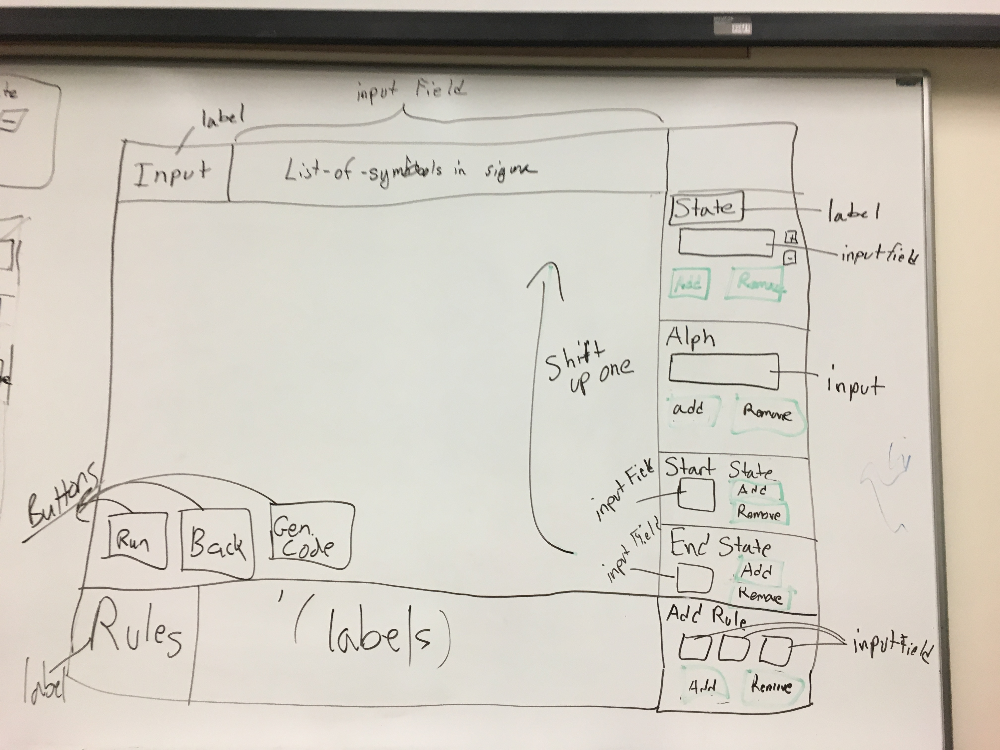

# FSM-Visualization

### World Variables
- list-of-states
- list-of-symbols
- start-state
- list-of-final-states
- list of rules
- list-of-symbols-in-sigma
- position on tape
- current rule
- current state
- list-of-buttons
- list-of-inputs
- list-of-proessed-configs
- list-of-unprocessed-configs

### Example Layout

### NOTE:
 - input => Red
 - Button => Blue
 - Labels => Green
